<h1 align="center">THE FLIGHT HUB</h1>

[View my live project here](https://natkewe.github.io/theflighthub/)

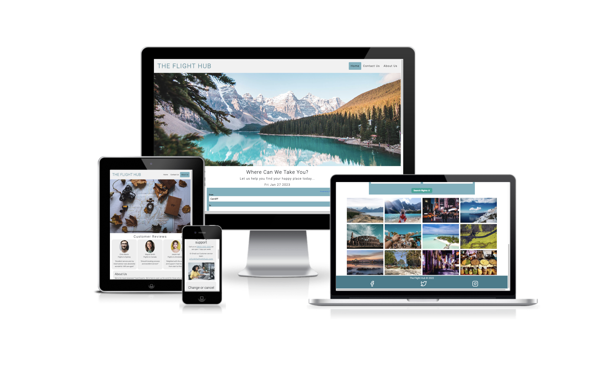  
This image is from [Am I responsive](https://ui.dev/amiresponsive)

This website was created to assist users in finding and booking flights to their desired locations, helping to provide inspiration on where they could go and what they might see when they get there.
The site should also make it easy to find out how to book a flight and how to contact someone for help using easy navigation links at the top of the page.

This website is made up of the following sections:

1. Nav bar
2. Search box to find available flights
3. Linked photograhs of different countries which show information on a particular Country
4. Contact Us page which gives several horizonal boxes with information and links to call us, search for their nearest Flight Hub store, or send an email
5. About us page with 3 reviews of previous Flight Hub customers, and a large information box underneath to explain who we are

The business goals for the website:

1. To help users find and buy a flight package through the Flight Hub and Skyscanner
2. To offer a site which is easy to navigate and meets the customers needs
3. To show that there is lots of support from Flight Hub employees and support is available for the customer when they book their flight

The user goals of the website:

1. As a first-time visitor, I want to be able to see clearly where I can search for flights, and to see that it would be easy to navigate
2. As a first-time visitor, I want to know how I can contact someone and what my options are in speaking to somebody
3. As a first-time visitor, I would like to see images and photographs that make me want to go and visit, and that help to offer me some inspiration
4. As a first-time visitor and returning visitor, I am looking for help in finding somewhere new to visit and some help in suggesting new places and attractions

----

<h2 align="center">(UX)</h2>

## Strategy

### Target audiance

- Users who are looking to find a quick holiday for a weekend away.
- Users that are looking for good deals for their annual family holiday.
- Those who are looking for inspiration on where they might want to travel to.
- Those looking to see if our prices are competative.

## Scope

After looking at the desired user and business goals, I am including the following on the site:

- A gallery of 12 images of Countries, when the user hovers over the images it states the name of the Country. The user then clicks on this writting and it takes them to a page with useful informaiton such as how long it takes to fly there and their currency.
- Easy to read Nav bar with quick access to pages such as ‘Contact Us’.
- The main content on the Home page will be where users can search for flights, and will be central and visable when the user visits the site.
- There would be a map towards the lower part of the home page where users can search for their desired country/city, and it will put a marker on the map and bring up local attracrions that they may want to visit.
- The Contact Us page will be clear and simple to find what you need, and a search area to find the nearest Flight Hub.
- A About Us page where it helps to inform the user of who they are buying their tickets from, and hopefully to give them confidence in the company and staff.
- Social links on the bottom of all pages where the user can find out more about the company and are able to see and share reviews and images.

## Structure

I an opting for the website to be over several pages, with the Home Screen having the most information on and all pages will be scrollable.
I am looking for the Home page to have a search area to look for flights and under the search area I am looking to add some photos of countries to make the Home page look inviting and inspirational, while also when the user clicks on the photo they are taken to some infomation about the Country and helpful facts using an API. Under the images there will be a Map which searches for attractions in an area the user chooses.
The Contact Us page is on its own page to help users who have already booked, or are having any problems find the right help instantly without having to scroll or navigate through the site, they can go direct to options of how to speak to a consultant.
I have created a main image for each page and set it so it zooms in and out without expanding in height. I have choisen lovely views of Countires that the user may imagine visiting.

## Skeleton

### Wireframes

- Home page wireframe - [View](documents/)

- Contact Us page wireframe - [View](documents/)

- About Us page wireframe -   [View](documents/)

## Surface

- There are three main colours used throughout my site, these were taken from [Color Adobe](https://color.adobe.com/search?)

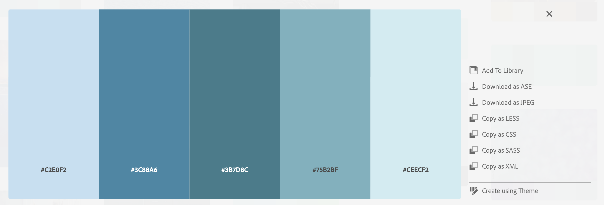

----

<h2 align="center">FEATURES</h2>

The website was created mobile-first, and is fully responsive. The site is devided into 3 pages which are all accessable from the Navigation bar. The images throughout the site were all taken from either Pexels or Adobe Stock Images, and the font I chose was Roboto found on Google Fonts

## Navbar

- The navbar is placed horizontally at the very top of the page, and has 3-page links on the far right. On the left hand side is the Flight Hub main heading. The 3 pages on the nav bar are the Home screen, Contact Us page and the About Us page. The navbar is fully responsive and when viewed on smaller screens these take up 100% of the width and stack onto the top of each other. The navbar is a blue color for the page the user is on, and when the user hovers over another page nav link the appear grey.

## Flight seach

- The flight search box is a large and easy to navigate search area for users to look at flights. This is a widget used in the site rather than an API at this time. It allows users to input whether they want to find flights to go one way or return, and also the date. The widget also find the nearest airport to the user (if they have enabled this to be allowed.)

## Gallery Images of Countries

- On the main home page there are 12 photos of different countries, they are all beautiful images and try to help inspire the user and even help them to picture themselves being there. 
The images are interactive by clicking on the image and it will not only inform you of the Country its self, but the link will then open a page where you get helpful informaion and facts about that country. 
This latter element is yet to be added.

## Map

- The Map is yet to be added.

(I am looking for this map to have a search bar where a user can search for a city or country, and it will then show them a helpful map of local attractions in that area, which would be helpful and also aid in some inspiration for the user.)

## Find your nearest store Map

- The Map shows you the local stores near you, and a helpeful map with pointers added. I wanted this to look nicer than an address link on its own, and it will help users quickly see what area of the country the stores are located.

----

<h2 align="center">TESTING</h2>

### User Stories:

1. As a first-time visitor, I want to be able to see clearly where I can search for flights, and to see that it would be easy to navigate

I have added a clear flight search box for users, where they can quickly see this when first landling on the site. It is responsive on smaller screens, and has easy to see buttons and colour choices used.

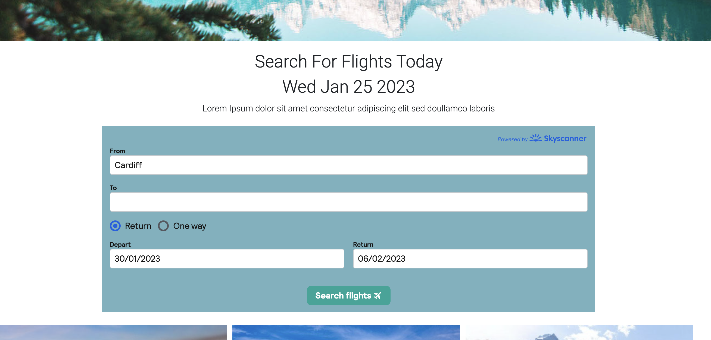

2. As a first-time visitor, I want to know how I can contact someone and what my options are in speaking to somebody

I have included a contact us page so make this very visable from whereever a user is on the site, and the contact page is clear and quick to find the desired information on how to contact the store.

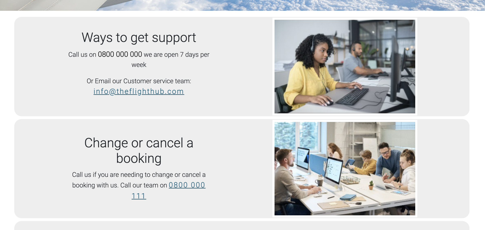

3. As a first-time visitor, I would like to see images and photographs that make me want to go and visit, and that help to offer me some inspiration.

I have added 12 images to the Home screen under the flight search box, this is to help offer some inspiration to users on where their next holiday could be, and also to link to the Travel API to offer the user more information about the country they have clicked on.

This feature is yet to be added.

4. As a first-time visitor and returning visitor, I am looking for help in finding somewhere new to visit and some help in suggesting new places and attractions

This element is yet to be added.

----

<h2 align="center">TECHNOLOGIES USED</h2>

- [HTML](https://developer.mozilla.org/en-US/docs/Web/HTML) (Used as the basic building block for the project and to structure the content)

- [CSS](https://developer.mozilla.org/en-US/docs/Learn/Getting_started_with_the_web/CSS_basics) (Used to style all the web content across the project)

- [Googe Fonts](https://fonts.google.com/) (Is a library of open-source font families via CSS)

- [Google Developer Tools](https://developer.chrome.com/docs/devtools/) (Used to help establish issues, fix bugs, and test the responsiveness of my pages)

- [GitHub](https://github.com/) (Used to store code for the project after being pushed)

- [Git](https://git-scm.com/) (Used for version control by utilising the Gitpod terminal to commit to Git and Push to GitHub)

- [Gitpod](https://www.gitpod.io/) (Used as the development environment)

- [W3 Schools](https://www.w3schools.com/) (Tutorials, references, and examples to help improve basic understanding of web development)

- [W3C Markup Validation](https://validator.w3.org/#validate_by_input) (Is for the testing of all HTML on the pages throughout my site)

- [W3C CSS Validation](https://jigsaw.w3.org/css-validator/#validate_by_input) (Is for the testing of the CSS throughout my site)

- [Bootstrap](https://getbootstrap.com/docs/5.0/content/typography/) (Is an open-source front-end development framework for the creation of websites and web apps)

- [Adobe Color](https://color.adobe.com/explore) (Create colour palettes with the color wheel or image)

- [Feather Icons](https://feathericons.com/) (A collection of simple open-source icons)

----

## Future Updates:

- 1. I am looking to make several changes such as adding an interactive map on the Home page where users can search for local attractiosn when searching for a city or contry. Also the gallery images I am looking to connect to a travel API to taken them to a helpful page for information and advise about the selected country from the image. I would also be looking to make the map on the contact us page to link to where the user is, to help give them directions directly to the store.

----

<h2 align="center">ISSUES AND BUGS</h2>

1. Running through Lighthouse I found that my blue telephone number and email liks were showing as difficult to read. I went onto Color Adobe again and found some similar shades to my colour palette and found a deeper blue which passed ok.  
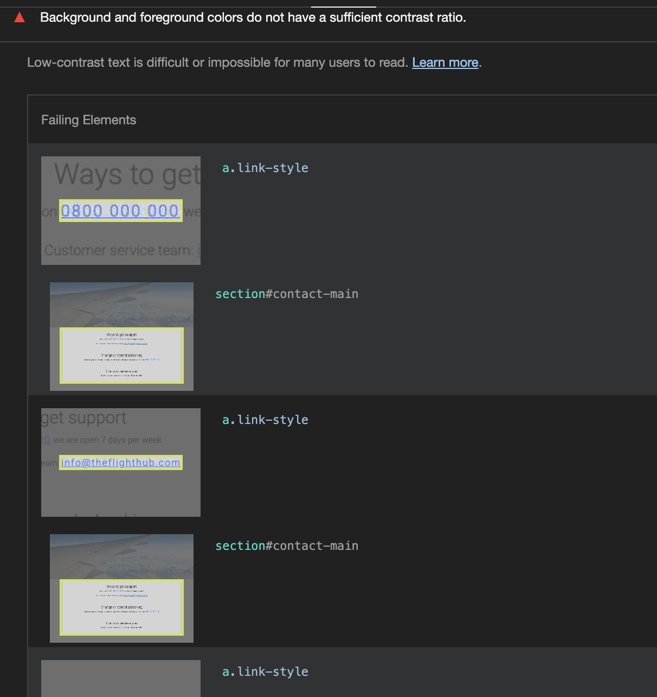

----

2. When running my index page through W3C validator, I had several errors. I had removed the 'type' attribute from my JavaScript links, I arranged my body tag so this included the header tags, and I corrected my JavaScript so it linked properly to my id of timings.  
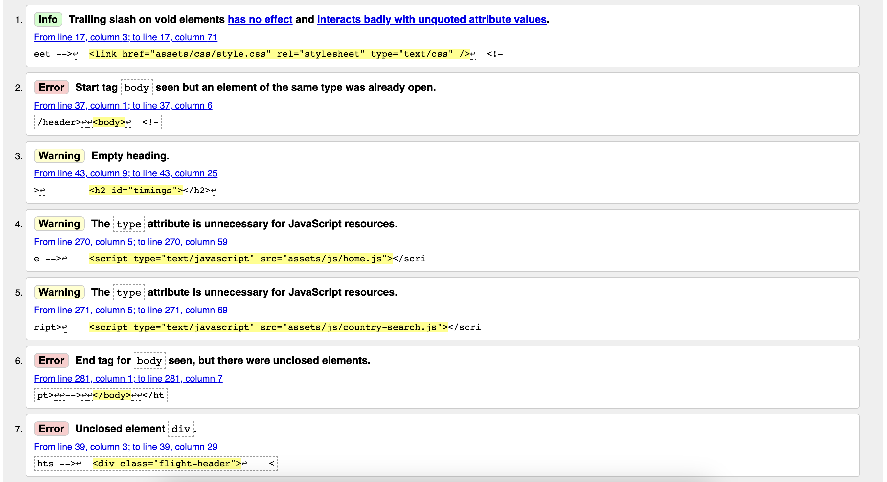

----

3. When running my index page through Lighthouse it showed an issue with my image sizes quite a lot. I added a lengh and height to all images, however with some images they still appear as either the lengh or height is more than they recocomend, so I have made sure I put them all in Abobe Resizer to get at least one side of the image as they requested.  
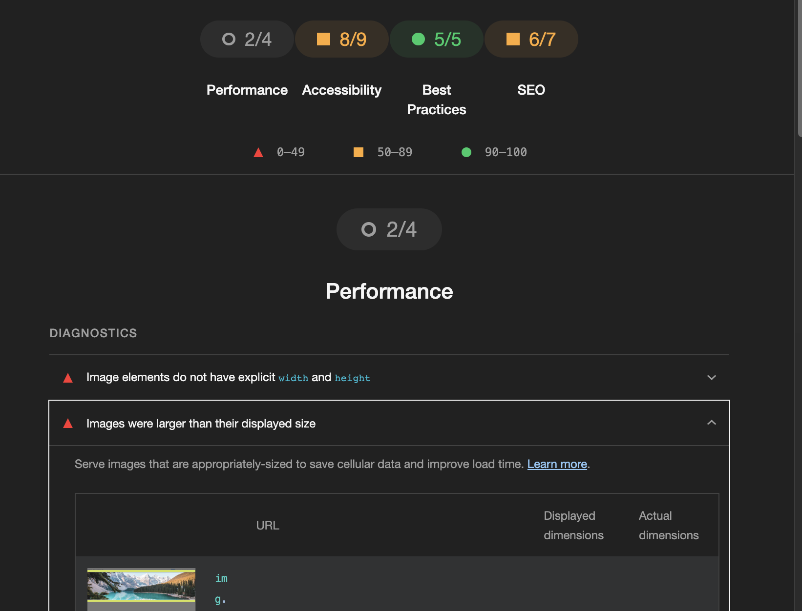

----

4. I found quite a few issues when running my contact us page through W3C validator. I removed the end slash on my css style link. I then removed the spaces I had left in both contact numbers, and I removed the alt attribute and put this lower down in my code and directly below the image I was referencing.  
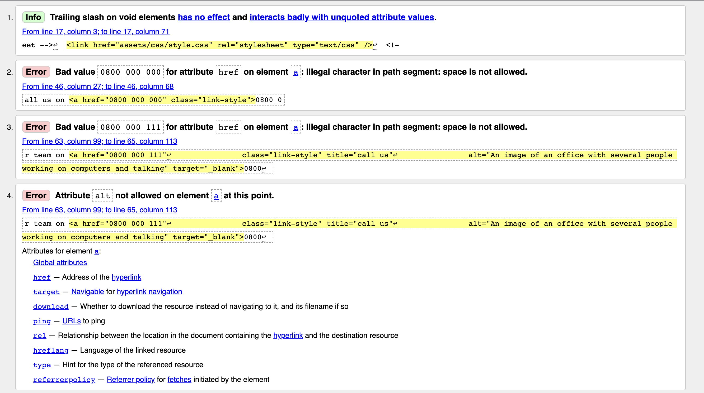

----

5. This was a simple one taken through Lighthouse where I had forgot to add a language attribute throughout all pages. I corrected this by adding the lang="en".  
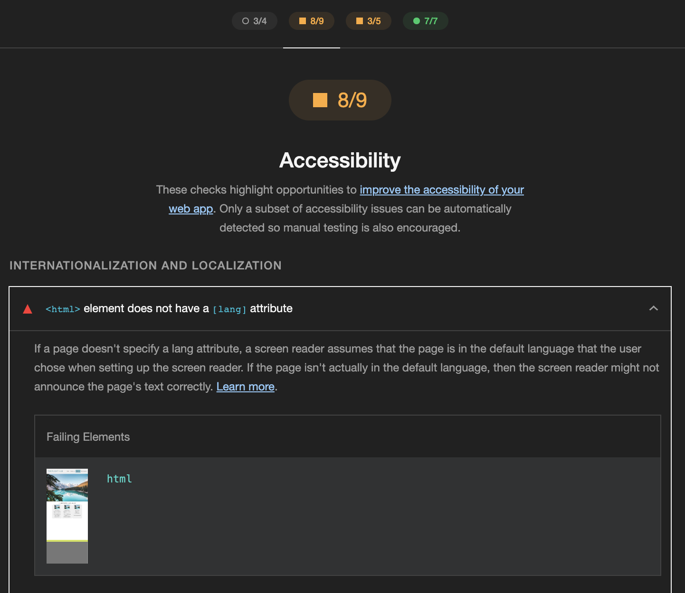

---

<h2 align="center">CODE PASSES - VALIDATOR</h2>

1. Screenshot from Chrome Lighthouse passing the code checker. The score for the performance of 3/4 is due to the height of my images not matching the recommended pxs, however, the height of my images are correct, and I used Photoshop to re-size all of my images to the recommended size to keep quality and help with site loading.
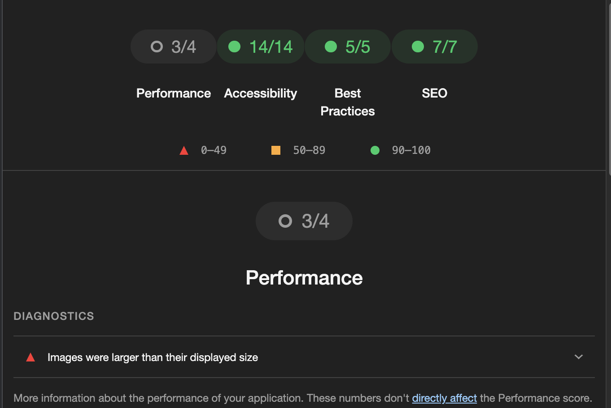

----

2. Screenshot from W3C HTML Validation Service of my HTML code passing without errors

----

3. Screenshot from W3C CSS Validation Service of my CSS code passing without errors
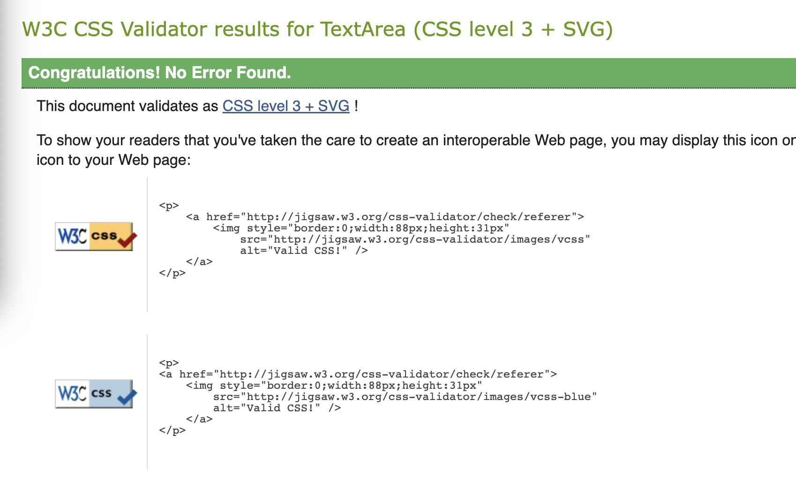

----

<h2 align="center">DEPLOYMENT</H2>

I deployed this website by using GitPages and following the below steps:

GitHub pages deployment

1. Log in to GitHub
2. In your Repository section, select the project repository that you want to deploy
3. In the menu located at the top of this section, click 'Settings'
4. Select 'Pages' on the left-hand menu - this is around halfway down
5. In the source section, select branch 'Master' and save
6. The page is then given a site URL which you will see above the source section, it will look like the following:

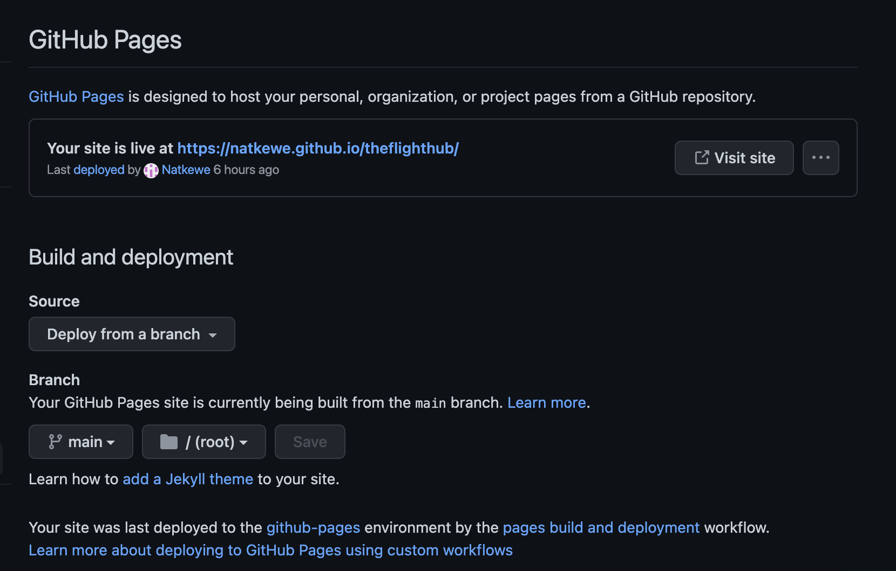

Forking the GitHub Repository

If you want to make changes to your repository without affecting it, you can make a copy of it by 'Forking' it. This ensures your original repository remains unchanged.

1. Find the relevant GitHub repository
2. In the top right corner of the page, click the Fork button (under your account)
3. Your repository has now been 'Forked' and you have a copy to work on
Cloning the GitHub Repository

Cloning your repository will allow you to download a local version of the repository to be worked on. Cloning can also be a great way to backup your work.

1. Find the relevant GitHub repository
2. Press the arrow on the Code button
3. Copy the link that is shown in the drop-down
4. Now open Gitpod & select the directory location where you would like the clone created
5. In the terminal type 'git clone' & then paste the link you copied in GitHub
6. Press enter and your local clone will be created.

----

<h2 align="center">CREDITS</h2>

I have used a number of resources to produce this website, where code has been used found from another source this is credited as a comment within the HTML and CSS files.

The following websites/articles were used for research and guidance:

- [Bootstrap](https://getbootstrap.com/docs/5.0/content/typography/) For the Gallery images on my Home page I used Bootstrap

- [W3 Schools](https://www.w3schools.com/) I used W3 Schools for a lot of guidance while creating my site, also in my navbar and heading

----
